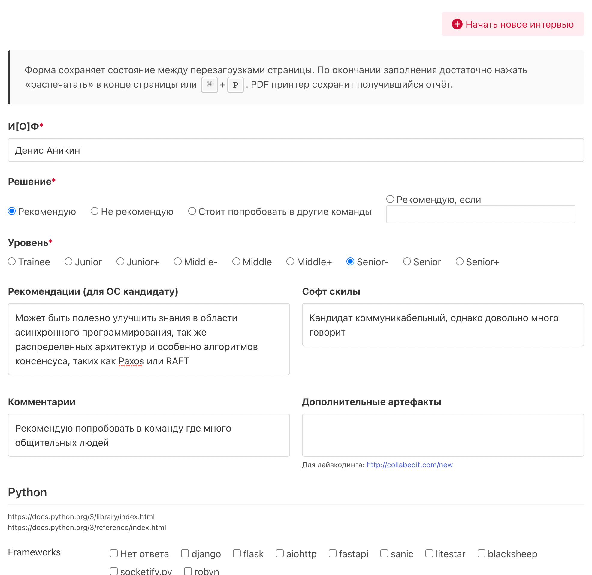

# Interview «engine»
 
This is simple interview «engine».

### Quickstart
1. You need to pick 1 file — [./index.html](index.html) and store it locally in convenient for you place
1. When interview began, open this file in, preferably, google chrome
1. Click button «Начать новое интервью»
1. Fill fields as you need
1. At the end of interview press ⌘ + P for MacOS X or ctrl + P for Windows and choose pdf printer
1. You receive pdf file with human-readable title (name of interviewed person will be in this path)

### Prepare questions
Fill JSON at the [./index.html:333](index.html#L333) line.

### Info
There is no actual questions in this file, only example for your understanding.  
Also, you can check output review format here [./docs/Интервью--Денис-Аникин.pdf](./docs/Интервью--Денис-Аникин.pdf)
